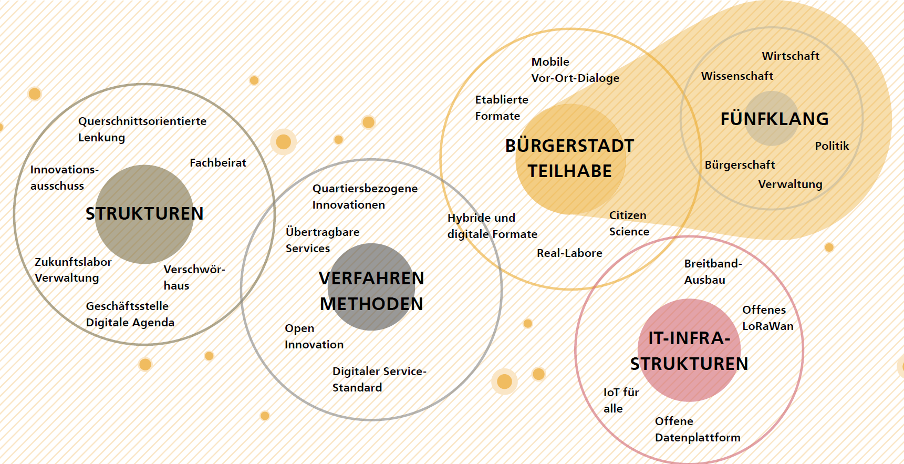

# Intro 
## Wieso, Weshalb, Warum? 
Ulm ist eine Stadt im Wandel und hat es sich zur Aufgabe gemacht, die Veränderungen und Umbrüche der kommenden Jahre gut zu gestalten. Dabei müssen sich alle kommunalen digitalen Ansätze an den großen Zukunftsaufgaben messen lassen: Wie können wir unsere wachsende und sich wandelnde Stadt so gestalten, dass Nachhaltigkeit und die Lebensqualität der Bürgerinnen und Bürger im Mittelpunkt stehen? Diese Frage steht für uns am Anfang der digitalen Transformation und ist Ausgangspunkt der Smart City Strategie, welche die Richtung für die nächsten 10 bis 15 Jahre vorgeben wird. Dabei beschränkt sich der Wirkungsbereich der Strategie nicht nur auf das Stadtgebiet selbst, sondern bezieht genauso die Region mit ein.  

Aufbauend auf der Analyse der Herausforderungen sind Visionen und Zielbilder entwickelt worden. Die verschiedenen Handlungsfelder beleuchten Potentiale und Risiken digitaler Ansätze und geben Umsetzungskonzepte vor.

### Smart City und Smart City Charta  
Weltweit leben schon heute mehr als die Hälfte aller Menschen in Städten. Der Anteil wird sich bis 2050 auf zwei Drittel der weltweiten Bevölkerung erhöhen. Gleichzeitlich nehmen Städte die meisten Ressourcen in Anspruch. Während die Bündelung von Ressourcen und Menschen auf begrenztem Raum gesellschaftliche, ökologische und strukturelle Herausforderungen darstellt, bietet sie gleichzeitig ein großes Hebel- und Skalierungspotential für mehr Nachhaltigkeit (WBGU , 2019).  

Ulm orientiert sich dabei an den 17 globalen Ziele für nachhaltige Entwicklung der Agenda 2030 [^1]. Sie beinhalten unter anderem Ziele für mehr Krisenresilienz, Ressourcen- und Energieeffizienz, mehr Nachhaltigkeit im Konsum- und Mobilitätsverhalten, wirtschaftliche Innovation und soziale Inklusion. Entsprechend bieten die Ziele auch Ansatzpunkte für die Herausforderungen der zunehmenden Urbanisierung. Der Begriff der Smart City ist unter anderem aus dem Kontext der nachhaltigen Stadtentwicklung entstanden. Das Bundesinstitut für Bau-, Stadt- und Raumforschung (BBSR) versteht unter Smart City die Aus- und Aufrüstung der Städte und ihrer Infrastrukturen mit digitaler Technologie und die Verknüpfung bisher getrennter Infrastrukturen oder ihrer Teilsysteme. Diese Teilsysteme und Infrastrukturen sind beispielsweise Energie, Gebäude, Verkehr, Wasser und Abwasser (BBSR, 2017). Entsprechend erweitert die Smart City „das Instrumentarium der nachhaltigen und integrierten Stadtentwicklung um technische Komponenten, sodass die Gesellschaft, der Mensch und seine Lebensgrundlagen auch zukünftig im Mittelpunkt stehen“ (BBSR, 2017, S. 10).“  

Die digitale Stadt verändert fast alle Bereiche des städtischen Lebens. Als Orientierung für die Gestaltung des digitalen Wandels wurde die Smart City Charta entwickelt (BBSR, 2017). Sie verfolgt den Ansatz einer integrierten und nachhaltigen, am Menschen ausgerichteten Stadtentwicklung. Die Charta enthält zwei zentrale Ziele: (1) lebenswerte Städte für Menschen zu schaffen und (2) gleichermaßen Städte als Entwicklungsakteure anzuerkennen.    

Diese beiden Ziele werden angesichts der weltweit zunehmenden Urbanisierung, Digitalisierung und Vernetzung künftig von zentraler Bedeutung sein. Denn es geht darum, wie wir in Zukunft leben wollen und wie die dafür nötige Handlungsfähigkeit und Gestaltungskraft der Kommunen gesichert und gestärkt werden kann. Die Stadt Ulm hat inhaltlich an der Smart City Charta mitgearbeitet und verpflichtet sich ebenfalls modellhaft aufzuzeigen, wie sie im kommunalen Handeln und in der Entwicklung unserer Städte verankert und zum Leben erweckt werden kann.    

Um die übergeordneten Ziele einer lebenswerten, nachhaltigen und bürgerzentrierten Stadt zu erreichen, ist neben dem Aufbau einer technischen Infrastruktur auch themen- und ressortübergreifendes Handeln erforderlich. Dafür ist es wichtig, dass alle Akteure in einer Stadt – Verwaltung, Stadtwirtschaft, Wissenschaft, lokale Wirtschaft und nicht zuletzt Bürgerinnen und Bürger sowie die vielen Organisationen der Zivilgesellschaft – zusammenarbeiten.

[^1]: https://sdgs.un.org/goals 

### Warum eine Smart City Strategie?
Die Stadt Ulm arbeitet bereits seit vielen Jahren in zahlreichen Projekten und mit vielen Maßnahmen an der Smart City (siehe Anhang). Dadurch hat sich Ulm bereits intensiv mit digitalen Themen beschäftigt und wichtige Grundlagen geschaffen, wie zum Beispiel LoRaWAN und IoT, Datenplattform oder Datenethik-Konzept. Auch im breiteren verwaltungsinternen Kontext betrachtet basiert die Strategie auf einer Vielzahl von Fachstrategien und -konzepten. Hier sind beispielhaft zu nennen: das Integrierte Stadtentwicklungskonzept 2019 [^2], Klimaschutzprogramm [^3], Mobilitätskonzept, die Kulturentwicklungsplanung [^4] und beispielhaft für die Verkehrspolitik ist der Verkehrsentwicklungsplan [^5]. **Die Strategie hat nun den Anspruch, diese zu bündeln, zu integrieren und Zusammenhänge herauszustellen.**  

Ein wesentlicher Bestandteil der organisationalen Veränderung ist die immer zentraler werdende Beteiligung der Bürgerschaft. Für Ulm ist sie wichtig, um bei der Stadtplanung zwischen dem Versprechen größerer Nutzer- und Bedienerfreundlichkeit für die Individuen in vielen Lebensbereichen einerseits und den übergeordneten Interessen von Stadtentwicklung im Sinne des Gemeinwohls andererseits abwägen zu können. **Die Stadt wird sich dafür in intensive Bürgerbeteiligungsprozesse begeben und die Stadt als Reallabor nutzen, um Bürger*innen zu ermöglichen, die generelle Zielrichtung mitzubestimmen.**   

Hervorzuheben ist vor allem auch die Bedeutung des kooperativen Prozesses aller Akteure. Die Stadt spricht hier von einem **Fünfklang, also der Einbeziehung von Bürger*innen, Wirtschaft, Wissenschaft sowie Verwaltung und Politik bei der Smart City Gestaltung.** Er dient dazu, ein gemeinsames Verständnis von den Herausforderungen, Chancen, Zielen und Schwerpunkten zu entwickeln. Nur so kann ein ganzheitlicher und inklusiver Prozess gewährleistet werden, der niemanden zurücklässt und Impulse in alle Bereiche der Stadtgesellschaft leistet.  **Die Strategie hat also zum Ziel, die beteiligten Akteure für ein gemeinsames Ziel hinter sich zu versammeln.**   

Die smarte Stadt nutzt Informations- und Kommunikationstechnologien (IKT), um kommunale Infrastrukturen zu verknüpfen. Um diese zu etablieren, sind Entscheidungen zur IKT-Auswahl und der zugrundeliegenden Systemarchitekturen zu treffen. Letzten Endes werden diese Technologien allerdings auch ein Fundament legen (1) für die Absicherung des Zugangs zu (digital gestützten, sozialen) Leistungen der Daseinsvorsorge und (2) für die Erreichung urbaner Entwicklungs- und Nachhaltigkeitsziele. (3) Zudem beeinflussen sie die Gestaltungsautonomie und Lebensqualität der Stadtgesellschaft. Deswegen setzen technologische Entscheidungen ein durchdachtes Abwägen der Alternativen voraus. **Die Smart City Strategie legt diese Grundlage. Dabei betrachtet sie auch Zielkonflikte (z.B. zwischen hohem Energieverbrauch digitaler Lösungen und Nachhaltigkeit) holistisch und identifiziert, wo Investitionen den größten Impact haben können.**   

Die Einführung smarter Technologien geht mit zentralen Risiken einher. Diese Risiken sind beispielsweise, dass durch die Datenspeicherung ein Risiko für staatliche und private Überwachung besteht, dass es ein Risiko zur Abhängigkeit von großen Technologieanbietern gibt und dass Technologien nicht Zweck, sondern Mittel zur Lösung von Stadtentwicklungsherausforderungen sein sollen. **Mittels der vorliegenden Strategie gilt es, diese und weitere Risiken eingehend zu verstehen und durch strategische Steuerung zu vermeiden.** 

[^2]: Stadt Ulm, 2019: Integriertes Stadtentwicklungskonzept der Stadt Ulm (ISEK) 
[^3]: Stadt Ulm, Klimaschutzkonzept der Stadt Ulm, GD 400/16. Download unter: https://buergerinfo.ulm.de/getfile.php?id=58712&type=do
[^4]: Stadt Ulm, 2016: Kulturentwicklungsplanung. Download unter: https://www.ulm.de/kultur/st%C3%A4dtische-kultureinrichtungen/kulturabteilung-ulm/kulturentwicklung 
[^5]: Stadt Ulm, Verkehrsentwicklungsplan Ulm (2013). Von: https://www.ulm.de/leben-in-ulm/verkehr-und-mobilitaet/oepnv/verkehrsentwicklungsplan 

## Nährboden und Projektumfeld: Bisherige Entwicklung zu einer digitalen Stadt 
### Ulmer Nährboden
Ulm beschäftigt sich seit mehr als 10 Jahren intensiv mit den Themen der Digitalisierung im Zusammenhang mit Stadtentwicklung. Dies machen vielzählige Projekte zur Digitalisierung deutlich. Eine Übersicht darüber finden Sie im Anhang. Zudem arbeitet die Stadt strategisch und kontinuierlich an zentralen Themenfeldern, die den Nährboden für den Erfolg der smarten Stadt legen. Diese Felder sind die (1) Teilhabe der Bürgerschaft und Fünfklang, (2) nachhaltige Strukturen, (3) eingesetzte Verfahren und Methoden und (4) die zugrundeliegende IT-Infrastruktur. 

#### Ulm als Lebendige Bürgerstadt: der Fünfklang
Ulm versteht sich als lebendige Bürgerstadt. Die Teilhabe der gesamten Stadtgesellschaft bildet die Grundlage, den Weg der Digitalisierung erfolgreich und vor allem nachhaltig zu beschreiten. Sie legt das Fundament, um Berührungsängste abzubauen und echten Mehrwert zu schaffen. Nur so kann sichergestellt werden, dass die Digitalisierung sich nutzerzentriert und zum Wohl der Gemeinschaft entwickelt, statt zum Selbstzweck zu werden. Die verschiedenen Akteursgruppen werden dabei mit unterschiedlichen Zielsetzungen eingebunden.  

**Einbindung im Fünfklang aus Bürgerschaft, Wirtschaft, Wissenschaft, Verwaltung und Politik
Bürgerschaft**
Der Bürgerschaft wird eine niederschwellige Beteiligung ermöglicht. Die Ansprache erfolgt stets zielgruppengerecht, um alle Ulmerinnen und Ulmer zu erreichen. Die aktive Mitgestaltung wird vorangetrieben und durch mögliche Ansätze im Bereich von Gamification unterstützt. Zusätzlich beschäftigt sich die Stadt Ulm mit dem Aufbau eines randomisierten Bürgerbeirats, um einen möglichst repräsentativen Querschnitt der Bürgerschaft direkt mit in die Stadtentwicklung zu integrieren. Dieses bietet sich vor allem für die Umsetzungsphase an, wenn konkrete Maßnahmen spezifiziert und noch enger an die Bedürfnisse der Bürgerschaft angepasst werden sollen. Für die Umsetzungsphase ist die konzeptionelle Planung eines Bürgerbeirats durch die geschaffene Open Government Stelle geplant und wird dort zentral verortet.

Neben der Bürgerschaft bedarf es allerdings auch an Akteuren aus Wirtschaft und Wissenschaft. Diese stehen gemeinsam mit der Verwaltung an vorderster Stelle, wenn es darum geht, die Smart City Ulm erfolgreich umzusetzen und die neuen Betreibermodelle zu ermöglichen. Dabei reicht es nichtmehr aus, die einzelnen Akteursgruppen nur zu informieren. Ihre Interessen, Bedürfnisse und Meinungen müssen aufgenommen und in der Smart City integriert werden. Durch Ko-Kreation und gemeinsames Zusammenarbeiten im Fünfklang aus Bürgerschaft, Wirtschaft, Wissenschaft, Verwaltung und Politik wird die Integration der verschiedenen Perspektiven bestmöglich umgesetzt. Die Stadt Ulm kann hierfür auch auf das starke Netzwerk zivilgesellschaftlicher, wirtschaftlicher und wissenschaftlicher Institutionen und Initiativen zurückgreifen.

**Wirtschaft**
Die wirtschaftlichen Akteure des starken Ulmer Ökosystems werden eingebunden, um Ideen frühzeitig mitzuentwickeln und Technologien über schnelle Prototypen in die Anwendung zu bringen. Gleichzeitig tragen sie dazu bei, auch große Lösungen umzusetzen und in den langfristigen Betrieb zu übernehmen. Dabei dienen existierende Netzwerke wie der Digital Hub (Digitalisierungszentrum) und die Initiative.ulm.digital e.V. als Multiplikatoren.

**Wissenschaft**
Die Wissenschaft setzt Impulse und ist Partnerin für Innovation und technologischen Fortschritt. Sie sichert den zukunftsfähigen Erfolg der Smart City Maßnahmen und trägt zum Ruf als Erfinder- und Wissensstadt bei. Dabei werden zukunftsweisende Technologien über die Anwendungsforschung bis hin zu Prototypen entwickelt. Um die Zusammenarbeit mit den wissenschaftlichen Instituten auch nachhaltig zu verankern, werden Kooperationsverträge mit der Universität Ulm, der Technischen Hochschule Ulm, der Hochschule Neu-Ulm sowie der Zeppelin Universität in Friedrichshafen geschlossen.

**Verwaltung**
Die beschriebenen Prozesse werden durch die Verwaltung ermöglicht, indem sie nutzerorientierte und anpassbare Formate bereitstellt, um den Austausch zu ermöglichen. Gleichzeitig setzt sie wichtige regulatorische Impulse, um sicherzustellen, mit allen Maßnahmen das Gemeinwohl im Blick zu behalten. Diese Prozesse müssen zunächst aufgebaut und aktiv gesteuert werden. Zur Koordination dieser zielgerichteten Kommunikation werden zentrale Strukturen benötigt, die verschiedenen Ansätze unter verschiedenen Zielgruppen zusammenzuführen und als gemeinsame Aktivitäten als Abbild der Stadt Ulm zu vermarkten.

**Politik**
Die Politik ist über den Gemeinderat als Hauptorgan eng mit dem Projekt verzahnt. Der Gemeinderat ist das zentrale Steuerungsgremium, in dem die Ausgestaltung und Ausrichtung des Vorgehens beschlossen wird. Alle strategischen Beschlüsse werden durch den Gemeinderat geprüft und dort (oder über Fachausschüsse) entschieden. Dazu gehört auch die IT-AG, welche sich aus Mitgliedern des Gemeinderats zusammensetzt.

#### Nachhaltige Strukturen
Nachhaltige Strukturen sind Voraussetzung für eine leistungsfähige und dauerhafte Verankerung im städtischen Handeln. Seit Jahren treibt der Ulmer Oberbürgermeister Gunter Czisch das Thema Digitalisierung als Markenbotschafter sowohl nach innen als auch nach außen an. Unterstützt wird er darin auch durch die lokalen Politiker:innen und Stadträt:innen. Dies zeigen die zahlreichen richtungsweisenden Beschlüsse, die bereits im Ulmer Gemeinderat gefasst wurden. 
Ein wichtiger Meilenstein für die Entwicklung der Smart City wurde mit der Erschaffung der Geschäftsstelle Digitale Agenda erreicht. Sie gehört zum Bereich des Oberbürgermeisters und unterstützt die Beantwortung wesentlicher Zukunftsfragen vor dem Hintergrund digitaler Mehrwerte. Sie entwickelt und testet innovative digitale Lösungen für und mit der Ulmer Bürgerschaft und der Ulmer Stadtverwaltung. Sie ist zuständig für den digitalen Stadtentwicklungsprozess und berät die Stadtverwaltung, um mit digitalen Lösungen schnellere, nutzerzentrierte und effizientere Services für die Bürgerschaft zu bieten. Mit dem Verschwörhaus und dem Kreativraum im Gebäude der Digitalen Agenda gibt es Orte zum Testen und Experimentieren für die Bürgerschaft und die Mitarbeiterinnen und Mitarbeiter in der Verwaltung.   

Neben der Digitalen Agenda ist der Innovationsausschuss ein wichtiges Gremium zu Digitalthemen. Er wirkt beratend bei der konzeptionellen Ausrichtung der Stadtpolitik und Stadtverwaltung in Zukunftsfragen im Bereich der Digitalisierung.[^6] Ihm gehören der Oberbürgermeister, Gemeinderatsvertreter*innen und Sachverständige an.  

Um die Politik und Verwaltung frühzeitig in den Prozess und in die Entscheidungen rund um die Digitalisierung einzubinden, hat es sich auch bewährt, eine querschnittsorientierte Koordinierungsrunde und Lenkungsgruppe einzurichten. Unter anderem über diese Formate werden alle Abteilungen der Stadtverwaltung und die Stadtwirtschaft kontinuierlich über laufende Prozesse informiert, darin eingebunden und beteiligt. Dieses Vorgehen ermöglicht es, ganzheitliche Entscheidungen zur digitalen Transformation zu treffen und einen Kulturwandel innerhalb der Verwaltung und der Bürgerschaft anzustoßen.   

Um die Smart City Strategie in Ulm zu festigen, beschäftigt sich das Kapitel 8 vertiefend mit den organisationalen Strukturen.

[^6]: Beschluss des Innovationsausschusses in GD 025/18. Download unter: https://buergerinfo.ulm.de/getfile.php?id=68686&type=do

#### Verfahren und Methoden
Innerhalb der Digitalen Agenda ist seit deren Entstehung Expertise und Methodenkompetenz unter anderem zu Verfahren der nutzerzentrierten Entwicklungen von Services sowie der Entwicklung quartiersbezogener Innovationen aufgebaut worden. Beide sind essenziell für die Ulmer Herangehensweise und fördern eine starke Fokussierung auf die konkreten Herausforderungen der Bürgerinnen und Bürger.  

Die konkreten Herausforderungen werden in verschiedenen städtischen Quartieren verortet. Sie sind modellhafte Testräume (Reallabore) für die Einführung digitaler Infrastrukturen und smarter Anwendungen. Dieses Vorgehen stellt sicher, dass die getesteten Lösungen übertragbar sind und neuen Mehrwert für eine Stadt mit hoher Lebensqualität zu schaffen.  

Bei der Auswahl der Technologien achtet Ulm darauf, dass diese dem Digitalen Servicestandard (BMI, 2020) entsprechen, also Best Practice-Grundsätzen bei der Gestaltung und Bereitstellung von Diensten folgen. Die Stadt Ulm setzt darauf, dass Technologien dezentral organisiert werden und auf Open Source Software basieren. Bei Open Source Software ist der Quelltext einsehbar, sodass sich ein Programm prüfen, korrigieren und erweitern lässt. Dezentrale Technologien verwalten Daten an verschiedenen Stellen. Sie haben also keinen Single Point of Failure, was sie robuster, effizienter, skalierbarer und demokratischer macht. Beispiele für dezentrale digitale Infrastrukturen sind Speicher für offene Daten, Bottom-up-Networking, Ad-hoc-WLAN, zusammengeschlossene Clouds und dezentrale Datenverwaltungssysteme. Auch dezentral gesteuerte Energiesystem zählen dazu. 
Beides trägt sowohl zur Resilienz der Verwaltung als auch zur Demokratisierung von Digitalisierungsprozessen bei. Zusätzlich werden auf diese Weise wirksam sogenannte Vendor Lock-In-Effekte vermieden, also die Abhängigkeit der Bürgerinnen und Bürger von einem zentralen IT-Anbieter. Die Auswahl soll mittel- und langfristig auch dazu führen, dass Innovation aus der Bürgerschaft (Bottom-up) und im Ko-Kreationsprozess lokaler Akteure entsteht (Open Innovation) – ganz nach dem Motto: von Ulm für Ulm.  
 
#### IT-Infrastruktur
Das Rückgrat einer zukunftsfähigen digitalen Stadt bildet eine ausgebaute Basisinfrastruktur. Die Stadt Ulm investiert daher seit vielen Jahren über die Stadtwerke große Summen in den Breitbandausbau im Stadtgebiet. Zuletzt konnte im größten städtischen Industriegebiet ein flächendeckender Ausbau fertiggestellt werden. Im Frühjahr 2020 erging zudem der Startschuss für den flächendeckenden Ausbau in der Ulmer Innenstadt. Die Stadtwerke setzen hier auf frühzeitige Information und Einbindung der Bürgerschaft. Weiter soll über rechtzeitige Abstimmung mit anderen Netzanbietern eine optimale Auslastung dieser Infrastruktur sichergestellt werden (Open Access).
Auch das Thema 5G wird durch die Stadtverwaltung aktiv begleitet: Im Rahmen des Innovationswettbewerbs des Bundesministeriums für Verkehr und Digitale Infrastruktur sollen nutzerorientierte Anwendungen für den Einsatz im Rettungswesen erarbeitet werden. Auch diese Technologie setzt auf einer leistungsfähigen Breitbandinfrastruktur auf.  

Zudem zählt Ulm zu den ersten Städten weltweit, die ein flächendeckendes LoRaWAN-Netz betreiben und dies offen, frei und kostenlos der Bürgerschaft zur Verfügung stellen. [^7] Es wurde speziell für den Einsatz von drahtlosen, batteriebetriebenen Geräten für das Internet der Dinge optimiert, um z.B. für Sensoren eine möglichst lange Batterielaufzeit zu gewährleisten.    

Die entstehenden Daten fließen auf einer Datenplattform zusammen. Die Datenplattform ist Grundlage für den urbanen Datenraum, also einen "digitalen Raum, welcher die relevanten Daten für den kommunalen Politik-, Verwaltungs- und Wirtschaftsraum enthält sowie alle Informationen, [...] um die Daten auffindbar und umgehend nutzbar zu machen" (Schieferdecker, et al., 2018, S. 15). Auf Basis des urbanen Datenraums können kommunale datenbasierte Geschäftsmodelle auf lokaler Ebene geschaffen werden. Damit leistet der Datenraum einen Beitrag zur kommunalen Datensouveränität. Wichtige technische Grundlagen, die dafür geschaffen werden müssen, werden in Kapitel 7 der Strategie vorgestellt.  

[^7]: https://lora.ulm-digital.com/#map 

### Ulmer Digitalprojekte
Die Stadt Ulm ist Teil der ersten Staffel des Förderprogramms Modellprojekte Smart Cities, in dessen Kontext die vorliegende Smart City Strategie entwickelt wurde. Sie baut auf einer Reihe von Digitalprojekten auf. Insbesondere die Förderprojekte Zukunftskommune@bw und Zukunftsstadt 2030 haben deutlich zur digitalen und nachhaltigen Stadtentwicklung beigetragen. Auf die wesentlichsten Aspekte wird in den folgenden Paragrafen eingegangen. Eine Übersicht über weitere Digitalprojekte finden Sie im Anhang.   

Das Projekt Zukunftskommune@bw wurde vom Land Baden-Württemberg gefördert. Es wurden digitale Angebote geschaffen, die clever, sicher, nachhaltig, offen und für alle Bürgerinnen und Bürger sind. Diese Angebote sind in sechs Themenfeldern zu verorten: (1) Leben im Quartier, (2) Mobilität, (3) Umwelt, Energie, Versorgung und Entsorgung, (4) Handel, (5) Geschäftsmodelle und (6) Datenplattform.   

Weiterhin hervorzuheben ist die Förderung als Zukunftsstadt 2030. In diesem vom Bundesministerium für Bildung und Forschung (BMBF) geförderten Projekt entstanden vier weitere Fundamente der Ulmer Smart City, nämlich (a) die Online Bürgerbeteiligungsplattform zukunftsstadt-ulm.de, (b) das Ulmer Datenethik-Konzept, (c) der Umgang mit Daten und die (d) LoRaWAN-Infrastruktur.
  

Das Projekt Zukunftskommune@bw wurde vom Land Baden-Württemberg gefördert. Es wurden digitale Angebote zu geschaffen, die clever, sicher, nachhaltig, offen und für alle Bürgerinnen und Bürger sind. Diese Angebote sind in sechs Themenfeldern zu verorten: (1) Leben im Quartier, (2) Mobilität, (3) Umwelt, Energie, Versorgung und Entsorgung, (4) Handel, (5) Geschäftsmodelle und (6) Datenplattform. Letzteres Themenfeld stellt ein Fundament der Ulmer Smart City dar. Es ermöglicht eine schrittweise übergreifende und intelligente Verknüpfung verschiedener Daten und Dienstleistungen des alltäglichen Lebens, die die Bürgerschaft komfortabel mit der Stadt verbindet und Potenzial für neue Dienstleistungs- und Wertschöpfungsinnovationen für die ansässigen Unternehmen schafft.  

Weiterhin hervorzuheben ist die Förderung als Zukunftsstadt 2030. In diesem vom Bundesministerium für Bildung und Forschung (BMBF) geförderte Projekt entstanden vier weitere Fundamente der Ulmer Smart City, nämlich die online (a) Bürgerbeteiligungsplattform zukunftsstadt-ulm.de, (b) das Ulmer Datenethik-Konzept, (c) der Urbane Datenraum Ulms, als auch die (d) LoRaWAN-Infrastruktur. 

## Post-Corona-Stadt 
Die Covid-19 Pandemie, vor deren Hintergrund die Strategie entstanden ist, führt auch der Stadt Ulm vor Augen, wie schnell sich der Alltag und feste Gegebenheiten verändern können. Breiter gefasst kann die Pandemie in den Kontext einer immer unbeständigeren, unberechenbaren, komplexeren und mehrdeutigen Umgebung gerückt werden. Im Laufe der Pandemie wurden so beispielsweise Erkenntnisse, Erfahrungen und Ideen gesammelt, wie Städte resilienter werden können. Beispielhaft werden einige hier kurz skizziert.   

Ein Ansatz ist in der Schaffung temporärer Plätze zu sehen, die physisches soziales Distanzieren in städtischen Umgebungen wie Straßen, Gassen, freien Flächen und Parkplätzen ermöglichen. [^8] Es kann davon ausgegangen werden, dass die sozialen Abstandsregeln langfristig zu einer deutlichen Reduktion der Flächenproduktivität in Gebäuden führen und beispielsweise mit Einschränkungen für den Einzelhandel verbunden sind (Zelt, 2020). Wie Ulm mit innovativen Handels-, Dienstleistungs- und Veranstaltungskonzepten darauf reagiert, wird aktuell und auch in Zukunft erforscht und getestet.  
Diese Neuordnung des öffentlichen Raumes kann ebenfalls durch die Ausweitung an Angeboten für virtuelle öffentliche Räume stattfinden. Das Abhalten von einfachen Meetings bis hin zu Digitalkonferenzen gehört mehr und mehr zu den Erfahrungen der Bürgerinnen und Bürger. Besonders bei größeren Events ist allerdings darauf zu achten, dass die Interaktion zwischen den Teilnehmenden und ein Gefühl des räumlichen Zusammenseins entsteht (Zelt, 2020). 
Auch die Themen Gesundheit und Bildung rücken im Kontext der Pandemie in den Vordergrund. Die Digitalisierung bietet umfangreiche Chancen, um trotz der sozialen Distanz gute Serviceleistungen erbringen zu können. Dennoch sollten diese Basisdienstleistungen so weit entwickelt werden, dass bestehende soziale Disparitäten im urbanen Raum nicht weiter verschärft werden und anderweitig neu auftreten.    

Des Weiteren kann der Mobilitätsalltag mit smarten Mobilitätskonzepten sicherer und nachhaltiger gestaltet werden, nämlich indem der Mix der urbanen Verkehrsträger, also Rad- und Fußwege und der ÖPNV mehr Raum bekommt, um eine neue räumliche Ausgeglichenheit für die Nutzung des öffentlichen Raumes zu schaffen. Der Umbau des Verkehrs, beispielsweise durch die Einführung von Pop-up-Bike-Lanes [^9], wird verbunden sein mit mehr ökologischem Bewusstsein.    

Das Wuppertal Institut sieht voraus, dass eine zukunftsfähige Stadt künftig näher, öffentlicher und agiler sein muss, um widerstandsfähig zu bleiben. Näher bezieht sich dabei auf: lokale Solidarität, die Bedeutung von Wirtschaftsstrukturen vor Ort und darauf, die Qualität von Erholungsräumen in unmittelbarer Nähe wieder zu entdecken. Öffentlicher bezieht sich darauf, die Kommunen als Garant der Daseinsvorsorge zu stärken und Nachhaltigkeit und gesunde Bürgerinnen und Bürger zusammen zu denken. Agil bezieht sich darauf, die sozialen und kreativen Potentiale der Stadt durch Digitalisierung zu nutzen (Schneidewind, Baedeker, Bierwirth, Caplan, & Haake, 2020).    

Entsprechend steht auch Ulm vor der Frage, welche (digitalen) Gestaltungsformen genutzt werden können, um resilienter zu werden und dabei soziale und wirtschaftliche Verwerfungen zu begrenzen. Diese und weitere Fragen fließen in die Entwicklung der Smart City Strategie der Stadt Ulm ein. Sie sollen einen Beitrag leisten, um aus der Perspektive der Smart City Antworten für eine Bewältigung bzw. einen Umgang mit krisenhaften Umbrüchen zu finden.   

[^8]: https://www.designfordistancing.org/
[^9]: https://www.zeit.de/2020-06/zukunft-stadt-verkehr-bueros-laeden-veraenderungen-coronavirus/komplettansicht 

## Ulmer Ansatz und Ulmer Werte
Der Ulmer Weg verbindet Lebensqualität und bürgerschaftliche Tradition mit wirtschaftlicher Perspektive – sichtbar und erfolgreich.  

 
**Lebendige Bürgerstadt**  
Die Ulmer Bürgerschaft hat in der Vergangenheit viel geleistet und zeichnet sich durch ihre eigene Art aus. Eine Meisterleistung ist beispielsweise der über 200 Jahre andauernde Bauprozess des Ulmer Münsters, welches allein durch die Ulmer Bürgerschaft gebaut wurde und das Wahrzeichen der Stadt ist. Ein weiteres Zeichen für die Emanzipation der Bürgerschaft ist der Schwörmontag. An diesem Tag wird der Rechenschaftsbericht des Oberbürgermeisters gegenüber den Bürgerinnen und Bürgern abgelegt – eine Tradition, die sich bis ins Jahr 1345 zurückverfolgen lässt. Auch die Ulmer Hochschule ist aus einer Bürgerinitiative in den 60er Jahren entstanden. Um diese aktive Bürgerschaft aufrechtzuerhalten, unterstützt die Stadt den Kompetenzaufbau der Bürgerschaft in Bezug auf Themen rund um die Digitalisierung.    

**Selbstbewusst und engagiert**
Die Ulmer Bürgerschaft zeichnet sich durch ein breites Engagement in Vereinen und Verbänden, Kirchen, karitativen und anderen gemeinnützigen Organisationen aus. Dieses Engagement soll auch in einer immer technologischeren Welt aufrechterhalten werden. Deswegen sind die Grundsätze der Ulmer Digitalisierungsstrategie: offen, für alle, clever und nachhaltig. Außerdem setzt Ulm auf technologische Souveränität, indem sich die Stadt die Unabhängigkeit von digitaler Infrastruktur und Diensten bewahrt und auf Open-Source-Lösungen setzt.   

**Erfinderstadt** 
Ulm wurde auch durch Berühmtheiten geprägt wie Albrecht Berblinger, Erfinder und Flugpionier, Albert Einstein, Entdecker der Relativitätstheorie und Conrad-Dietrich Magirus, Technologiepionier und Unternehmer. Aber auch darüber hinaus bietet Ulm Platz für zahlreiche bekannte Unternehmen, wie die 1844 gegründete Seeberger GmbH, Siemens AG und die Breuer GmbH. Die digitale Transformation wird den Erfindergeist der Stadt brauchen, denn die Karten in Bezug auf die Standortpolitik und Stadtentwicklung werden mit der Digitalisierung neu gemischt.   

**Tolerant und weltoffen**
In Ulm leben mittlerweile über 140 verschiedene Kulturen friedlich zusammen – mehr als jeder zweite Einwohner hat Wurzeln in einem anderen Kulturkreis. Ulm ist Wissenschaftsstadt und befindet sich in einer sehr wirtschaftsstarken Region. Beide Kompetenzen sind für die neuen Stadtbürgerinnen und Bürger die Hauptgründe, um nach Ulm zu ziehen. Ulm möchte sich diese Offenheit bewahren, denn sie bildet ein Fundament für das Gemeinwohl der Stadt.  

## Smart City Vorbilder
Ulm steht auf dem Weg zu einer besseren Verbindung zwischen Digitalisierung und Stadtentwicklung nicht allein da. Viele, vor allem europäische Städte haben Ideen und Anstöße gegeben. Beispielhaft gehen wir auf drei Städte ein und zeigen, was uns inspiriert hat.  

So hebt sich Amsterdam dadurch hervor, dass die Stadt als Erprobungsraum innovativer Lösungen den Bürgerinnen und Bürgern, der Wissenschaft und den Unternehmen angeboten wird. Dadurch möchte die Stadt erreichen, bis zum Jahr 2040 ein nachhaltig und wirtschaftlich starker Standort zu werden. Auch Ulm möchte die Stadt in ein Reallabor umwandeln, wo Smart City Lösungen für die Bürgerschaft greifbar und vor allem nutzerzentriert entwickelt werden.   

Für Barcelona dient die smarte Stadt der Zukunft dem Gemeinwohl und somit der Bürgerschaft. Sie baut auf der Beteiligung der Bürgerschaft auf und befähigt die Verwaltung, die Bürgerschaft und die lokale Wirtschaft, die Möglichkeiten der Smarten Stadt zu nutzen. Indem sich Ulm hier ein Vorbild nimmt, wird die Teilnahme der Bürgerschaft weiter gestärkt und die Ansätze der Smart City Charta in der Umsetzung verankert.   

Eindhoven setzt den Fokus auf die Smart Society. Damit sieht sie die Bürgerschaft als Schlüssel zur Lösung der wichtigsten Herausforderungen. Um bei einer zunehmend vernetzten Gesellschaft das öffentliche Interesse weiterhin zu wahren und Datenschutz zu gewährleisten, entwickelt die Stadt Eindhoven die Smart Society Charta. Die Charta legt wesentliche IoT-Architekturprinzipien und -Richtlinien fest.[^10] Ulm möchte sich unter anderem für die Umsetzung der Ulmer Datenplattform inspirieren lassen.  

Für die Entwicklung der Ulmer Smart City Strategie sind diese Erkenntnisse und Erfahrungen sehr wichtig. Gleichzeitig ist die Strategie in den Ulmer Gegebenheiten und der Kultur verortet. So gibt der Ulmer Weg vor, dass die Smart City nicht technologiegetrieben betrachtet wird. Stattdessen soll die Technologie im Sinne der Smart City Charta und für eine nachhaltige Stadtentwicklung und Nachhaltigkeit wirksam werden.   

[^10]: https://data.eindhoven.nl/terms/terms-and-conditions/ 

