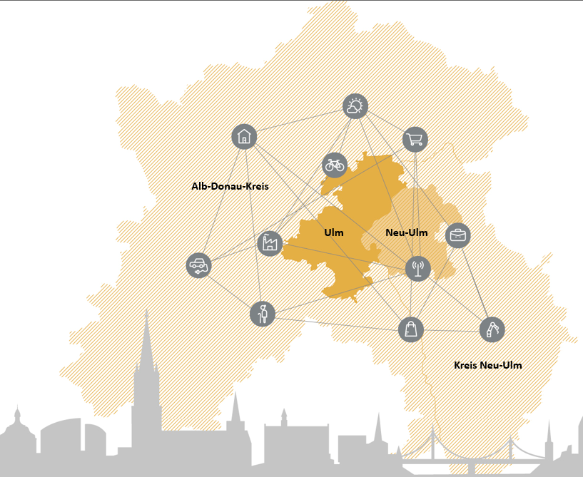
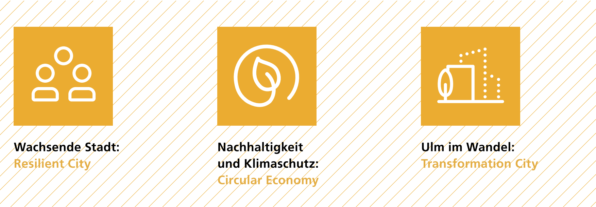
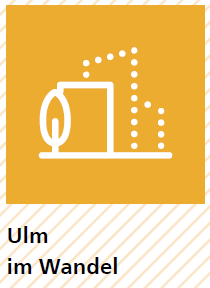
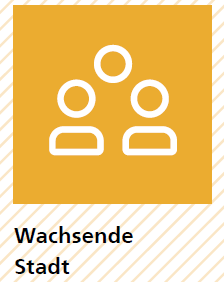
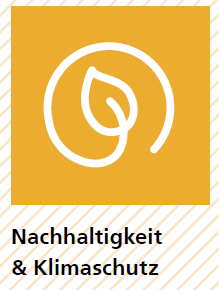
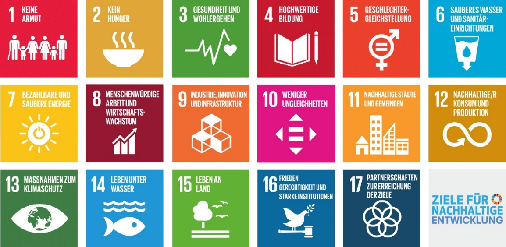
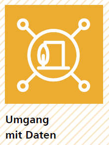

# Unsere Ausgangslage und Herausforderungen 
Die Smart City Strategie Ulms baut auf vergangenen Entwicklungen und der gegenwärtigen Situation der Stadt auf. Um dies zu erreichen wurden bestehende Konzepte und Gutachten analysiert und Gespräche mit lokalen Akteuren, der Stadtverwaltung und den Stadtwerken geführt. Auf diese Weise generiert die Strategie kontextspezifische Lösungen für die Stadt und somit echten Mehrwert. Im folgenden Kapitel wird die gegenwärtige Situation der Region und der Stadt beschrieben und die Ulmer Zukunftsaufgaben dargestellt. 

## Region
 
Ulm ist eine sehr gut vernetzte Stadt und tief verwurzelt mit der Donau-Iller Region, in der sie sich befindet. Es handelt sich hierbei um eine Ländergrenzen überschreitende Planungsregion und Regionalverband in Baden-Württemberg und Bayern. Sie umfasst den Stadtkreis Ulm, den Alb-Donau-Kreis und den Landkreis Biberach in Baden-Württemberg sowie die kreisfreie Stadt Memmingen, den Landkreis Günzburg, den Landkreis Neu-Ulm und den Landkreis Unterallgäu in Bayern.  

Die gute Verkehrsanbindung und die Lage im Süden unterstützt die Region darin, eine der wirtschaftlich dynamischsten und gründungsaktivsten Regionen Deutschlands zu sein. Gebündelt werden die wirtschaftlichen, sozialen, kulturellen und bildungsrelevanten Interessen der Region durch den Verein zur Förderung der Innovationsregion Ulm – Spitze im Süden e.V. Sie bildet die Klammer zwischen den beiden Städten Ulm und Neu-Ulm und den umgebenden Landkreisen.  

Aus den Herausforderungen ergeben sich drei Zukunftsthemen für die Region, nämlich Mobilität, Energie und Digitalisierung. Diese Schwerpunktsetzung bündelt die Aktivitäten und fördert die Zusammenarbeit. In Bezug auf die Digitalisierung wurde beispielsweise das Digitalisierungszentrum Ulm | Alb-Donau | Biberach gegründet. Hier werden technische Infrastruktur und Know-how zur Erprobung und Entwicklung neuer digitaler Lösungen, Produkte und Geschäftsmodelle für Unternehmen aller Branchen zur Verfügung gestellt. Dazu werden unter anderem auch Räumlichkeiten für Experimentierräume, Informationsräume und Coworking Spaces bereitgehalten.  

Aus Raumplanungsperspektive ist Ulm untrennbar mit der Nachbarschaftsstadt Neu-Ulm verbunden. Aus diesem Grund sind verschiedene Themenbereiche zusammen verwaltet. Dies zeigt beispielsweise der im Jahr 2000 ins Leben gerufene Stadtentwicklungsverband Ulm/Neu-Ulm, welcher als grenzüberschreitende Wirtschaftsförderungseinrichtung fungiert.   
> "Mit der Etablierung des Verbandes wollen beide Städte die negative Konkurrenz der Vergangenheit überwinden, die Wettbewerbsfähigkeit stärken, vorhandene Flächenentwicklungspotentiale gemeinsam nutzen und somit zur Sicherung und Schaffung von Arbeitsplätzen und der Stärkung des regionalen Bewusstseins beitragen."

## Zukunftsaufgaben der Stadtentwicklung
Ulm zählt zu den Städten mit der höchsten Lebensqualität in Deutschland und Europa und ist ein bedeutender Industriestandort und Teil einer der wirtschaftlich stärksten Regionen Europas. Die Stadt kooperiert als Wissenschaftsstadt in einem weit gespannten Netzwerk aus Universitäten, Hochschulen, Kliniken und Forschungseinrichtungen. Industrie und Wissenschaft arbeiten ebenfalls stark verzahnt zusammen. In Zeiten des konstanten Wandels gilt es, diese Lebensqualität und Wirtschaftsstärke aufrechtzuerhalten. Beides soll durch den Ulmer Grundsatz, die Digitalisierung als Chance und als Querschnittsthema der integrierten Stadtentwicklung zu betrachten, aktiv (mit-)gestaltet werden.  

Vier übergreifende und querschnittsorientierte Zukunftsaufgaben sind für die Stadt von besonderer Bedeutung (s. Abb. 2): (1) Ulm im Wandel, (2) Wachsende Stadt, (3) Nachhaltige Stadtentwicklung, Klimaschutz und Kreislaufwirtschaft und (4) Urbaner Datenraum, technologische Souveränität und Datenethik. Herausforderungen und Entwicklung als Konsequenz der Corona Pandemie werden hier aufgegriffen. Jede der vier Aufgaben wird in den folgenden Abschnitten genauer beleuchtet.

  

Um diese Aufgaben zu lösen, möchte Ulm auf seine eigenen Stärken bauen und diese weiterentwickeln. Dazu zählen zum Beispiel (a) die aktive Bürgerschaft, (b) die Forschungskompetenz ausgedrückt in der Wissenschaftsstadt, (c) das engagierte Unternehmertum und (d) das querschnittsorientierte und mutige Herangehen an die Herausforderungen. Die Zukunftsaufgaben sollen exemplarisch in ausgewählten Quartieren bearbeitet werden.  

Ulm ist sich dessen bewusst, dass Veränderungen Zeit brauchen, um sich durchzusetzen und um von der Stadtgesellschaft akzeptiert zu werden. Man rechnet mit 10 bis 15 Jahren bis disruptive Erfindungen im Markt ankommen. Genau für diese Zeitspanne (2022–2037) soll die vorliegende Strategie dienen. Besonders die Digitalisierung wird vielfältige soziale, kulturelle und strukturelle Veränderungen mit sich bringen. Diese gilt es zu gestalten und als Lösungsansatz für die Herausforderung der Stadt zu nutzen. Dafür braucht es Ausdauer und Kreativität, aber auch sichtbare Erfolge, die bei der Bürgerschaft Mut und Zuversicht stiften.

### Ulm im Wandel
 Die Digitale Transformation wird auch in der Bürgerschaft Veränderungen bewirken. Schon heute verändert sie das soziale Miteinander, welches zunehmend im virtuellen Raum stattfindet. Diese Tendenz hat mit der Corona-Pandemie stark zugenommen. Es stellt sich immer mehr die Frage, wie gesellschaftliche Teilhabe und der soziale Zusammenhalt unterstützt und gefördert werden kann und welche Chancen sich für das Zusammenleben und die Nachbarschaft bieten (s. Handlungsfelder S. - 39 -).  

Alle Menschen in Ulm sollen zu einer selbstbestimmten und souveränen Teilhabe am gesellschaftlichen Alltag befähigt werden. Dazu ist ein kontinuierlicher persönlicher Erwerb digitaler Kompetenzen, also lebenslanges Lernen, unerlässlich. Die Vermittlung dieser Kompetenzen begleitet die Bürgerinnen und Bürger ein Leben lang: beginnend in der Schule, über die Aus- und Weiterbildung oder im Studium, im Beruf und darüber hinaus. Die Kultureinrichtungen in der Stadt verstehen sich als Impulsgeber und einladende Orte. Sie nutzen digitale Möglichkeiten für die Entwicklung neuer Angebote und bieten niederschwellige Zugänge.   

Benachteiligte Menschen sollen unterstützt, der solidarische Zusammenhalt gestärkt werden und gesellschaftliche Barrieren abgebaut werden. Unabhängig von sozialer Herkunft, Handicaps, Sprache sowie Bildungs- und Einkommensniveau sollen individuelle Entwicklungschancen verbessert werden.
 

### Wachsende Stadt
 Seit über 10 Jahr erfährt Ulm ein rasantes Bevölkerungswachstum. Im Zeitraum von 2012 bis 2018 ist die Zahl der sozialversicherungspflichtigen Beschäftigten in Ulm um 6 % auf 126.000 Einwohner angestiegen. Dieses Wachstum wird mit dem Ausbau der ICE-Hochgeschwindigkeitsstrecke, welche bis 2022 fertiggestellt sein wird, weiter zunehmen. Der Grund dafür ist, dass die Stadt dadurch noch näher an die Metropolregionen Stuttgart und München heranrückt. Außerdem zieht die prosperierende Wirtschaft zahlreiche Pendler in die Stadt.   

Die steigende Zahl an Einwohnern hat in den vergangenen Jahren zu einer Nutzungskonkurrenz zwischen Wohnungs- und Gewerbeflächen geführt. Der ansteigende Personen- und Güterverkehr und die Nähe zu den Metropolregionen stellt die Stadt vor die zentrale Frage: Wie kann bei knapper Flächenverfügbarkeit angemessen Wohn- und Gewerberaum zur Verfügung gestellt, ein zukunftsgerichtetes, nachhaltiges Mobilitätskonzept entwickelt und die Innovationskraft der Wirtschaft aufrechterhalten werden?
Die Digitalisierung im Zusammenhang mit Wohn- und Gewerberaum kann dabei unterstützen, die Nutzung von Räumlichkeiten zu verdichten. Dies veranschaulicht der digitale und mobile Arbeitsplatz verbunden mit dem Homeoffice. Auch Multifunktionsorte verbunden mit Coworking Spaces führen zur Verdichtung der Raumnutzung. Die beschriebenen Ansätze haben mehrere Vorteile: sie reduzieren das Pendler-Aufkommen, sie verbessern die Vereinbarkeit von Beruf, Freizeit und Familie und sie verlagern die Kaufkraft zurück an den Wohnort oder die Innenstadt. Sie haben also das Potential, das Gemeinwohl zu steigern.  

Nachhaltige Mobilitätskonzepte beziehen sich auf intelligente, intermodale Mobilitätslösungen, die die Umwelt und Ressourcen schonen. Intelligente und bedarfsgerechte Mobilitätsdienstleistungen beabsichtigen, die Nutzung des ÖPNV attraktiver machen und Mobilitätslösungen bedarfsgerecht zu einer individualisierten Mobilitätskette zu kombinieren. Im Ergebnis soll der Individualverkehr reduziert und gezielter durch die Stadt geleitet werden.   

Um den Wohlstand der Stadt aufrechtzuerhalten, braucht es eine starke lokale Wirtschaft. Diese sollte die Digitalisierung als Chance sehen, um neue Geschäftsmodelle zu entwickeln. Gleichzeitig sollte sich die Wirtschaft generationengerecht ausrichten und sich an den nachhaltigen Entwicklungszielen orientieren. In diesem Bestreben sollten die Wissenschaft und die Wirtschaft ihre Kooperationen und Vernetzungen weiter intensivieren und ausbauen. Auch die Bürgerschaft sollte in diese Bestrebungen einbezogen werden mit dem Ziel, dass Innovationen nutzerorientiert sind und sichtbar und erfahrbar gemacht werden. Ein Good Practice-Ansatz ist, dafür die Stadt als Reallabor zu nutzen. Die Smart City Projekte und Aktivitäten der Stadt bieten dafür den geeigneten Rahmen.

### Nachhaltige Stadtentwicklung, Klimaschutz und Kreislaufökonomie
 Die globalen und lokalen Entwicklungen zeigen immer deutlicher, dass Kommunen resilienter werden müssen, um sich an die Veränderungen der Zeit anpassen zu können. Die Digitalisierung bietet dabei zusätzliche Chancen, dies zu erreichen. Eine nachhaltige Werteorientierung ist dabei wegweisend, um krisenresilient zu werden. Nachhaltigkeit versteht sich als ganzheitlicher Ansatz, indem ein Gleichgewicht zwischen sozialen, ökologischen und ökonomischen Aspekten hergestellt wird. Dies ist für die Stadt Ulm bei der Stadtentwicklung richtungsweisend. Klimaschutz und die Unterstützung einer Kreislaufökonomie sind dafür unerlässlich.  

Bei dieser Zukunftsaufgabe orientiert sich die Stadt an den nachhaltigen Entwicklungszielen der Vereinten Nationen (s. Abbildung 3 auf S. - 22 -), am Hauptgutachten „Unsere gemeinsame digitale Zukunft“ und den Prinzipien der Kreislaufökonomie basierend auf der Ellen McArthur Stiftung. [^11]

Das Thema nachhaltige digitale Stadtentwicklung betrifft insbesondere das Ziel 11 – Nachhaltige Städte und Gemeinden. Hier geht es unter anderem um Energie- und Ressourceneinsparung, inklusive und partizipative Stadtplanung und darum, den Technologieeinsatz für alle Bevölkerungsschichten sinnvoll und nutzenstiftend zu steuern.  

Die Stadt Ulm hat sich zum Ziel gesetzt, im Bereich der nachhaltigen Entwicklung Vorreiter zu werden. Die Digitalisierung soll sie in diesem Bestreben unterstützen. Seit 2018 laufen im Kontext des Projektes Zukunftsstadt 2030 Aktivitäten, die sich auf das Thema Nachhaltigkeit und Digitalisierung spezialisiert haben. Diese Aktivitäten sollen innerhalb dieser Zukunftsaufgabe ausgebaut werden.   

Die Kreislaufwirtschaft leistet einen wesentlichen Beitrag zur Erreichung der nachhaltigen Entwicklungsziele, unter anderem Ziel 11 und Ziel 13 (Klimaschutz), denn mithilfe dieses Ansatzes werden die Material- und Energiekreisläufe optimiert und möglichst geschlossen. Die führt zu (signifikanter) Ressourceneinsparung und reduziert die Emission von Treibhausgasen. Durch die Digitalisierung entstehen Schlüsseltechnologien wie IoT Plattformen und künstliche Intelligenz, welche die Ausweitung der Kreislaufwirtschaft vereinfachen. Gleichzeitig eröffnet sie Chancen für die Entwicklung neuer Geschäftsfelder und Geschäftsmodelle.  

Damit Ulm in Zukunft noch krisenresilienter wird, ist der Klimaschutz unerlässlich. Es ist das erklärte Ziel der Stadt, den Treibhausgasverbrauch bis zum Jahr 2050 auf 2 Tonnen pro Kopf zu reduzieren. Dabei fokussiert sie sich auf die wichtigsten Emissionsquellen Strom, Wärme und Verkehr. Die Verwaltung der Stadt möchte beim Thema Klimaschutz ihre Vorreiterrolle behalten und bereits im Jahr 2025 nahezu klimaneutral zu sein. Um diese ambitionierten Ziele für die Verwaltung und die Gesamtstadt zu erreichen, kann die Digitalisierung beispielsweise durch intelligente Steuerungssysteme (IoT) bei der Umsetzung der klimapolitischen Maßnahmen unterstützend wirken.

[^11]: https://www.ellenmacarthurfoundation.org/circular-economy/concept 

### Umgang mit Daten
 Die fortschreitende Digitalisierung verändert unseren Alltag in vielen Lebensbereichen. Um allen Menschen, ob alt oder jung, mit oder ohne Behinderungen die Chance zu geben sich selbstbestimmt im digitalen Alltag zu bewegen, fördert die Stadt Ulm die technologische Souveränität und einen ethischen Umgang mit Daten. Der Umgang mit Daten legt fest, dass Daten im Hoheitsbereich der Stadt bleiben und nach den städtischen Spielregeln genutzt werden. Nur dann bleibt die smarte Stadt auch in den Händen der Bürgerschaft.  

Technologische Souveränität bezieht sich darauf, Open Source Software, dezentrale Technologien, offene Standards und Open Data zu nutzen. Die lokale Digitale Community treibt den Prozess der technologischen Souveränität an und wird unterstützt durch eine enge Einbindung der Bürgerschaft. Auf diese Art und Weise wird sichergestellt, dass die Steigerung des Ulmer Gemeinwohls der Motor für die Digitalisierung ist. Indem Ulm Code und Daten der Öffentlichkeit zur Verfügung stellt, setzt die Stadt außerdem darauf, langfristig autonom und unabhängig von privatwirtschaftlichen IT-Unternehmen zu bleiben und den Bürgerinnen und Bürgern einen transparenten Umgang mit ihren Daten zu garantieren.  

Datenethik ist ein zentrales Element der technologischen Souveränität. Deswegen besitzt Ulm bereits ein vom Gemeinderat ratifiziertes Datenethik-Konzept. Es schafft die Voraussetzung, dass mit persönlichen und anderen schützenswerten Daten sorgsam, transparent und sparsam umgegangen wird. 
Derzeit wird eine zentrale, offene Datenplattform aufgebaut. Sie ist Grundlage für den Umgang mit Daten. Die Datenplattform verbindet die in der Stadt befindlichen Sensoren und unterstützt die Vernetzung verteilter Datenquellen. Dadurch können städtische Problemlagen identifiziert, Zusammenhänge und Auswirkungen besser analysiert und passgenauere Lösungen dafür entwickelt werden. Sie bietet eine Chance für Innovation und neue (soziale) Geschäftsmodelle, welche von der regionalen Wirtschaft entwickelt werden können. Dadurch wird die Stadt darin bestärkt, auch in Zukunft ein Zentrum für Wissen und Beschäftigung zu bleiben.  

Der Aufbau der technischen Infrastruktur wird unterstützt durch das Experimentieren mit zentralen Zukunftstechnologien wie LoRaWAN, 5G, und Internet of Things-Lösungen. Für diese Technologien werden konkrete Anwendungsfälle in Quartieren der Stadt Ulm identifiziert und getestet. Mit diesem Vorgehen stellt Ulm sicher, dass die städtischen Infrastrukturen smart, flexibel, resilient und sicher gestaltet sind.   

Dieses Zukunftsthema ist ein Querschnittsthema, welches wesentlich dazu beiträgt, das Verhältnis zwischen Regierung und der Bürgerschaft neu zu denken, um sicherzugehen, dass diese die demokratische Kontrolle zurückgewinnen und vollständig an der Gestaltung der öffentlichen Ordnung mitwirken können.