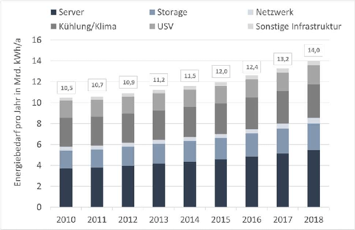

# Energie

Der Energiebedarf der Gesellschaft ist die Hauptursache der anthropogenen Treibhausgasemissionen. Entsprechend stellt die Energiewende einen wesentlichen Beitrag zum Klimaschutz der ‚Klimastadt Ulm‘ dar. Bei der Energiewende geht es darum, konventionelle Energieträger in Zukunft durch erneuerbare Energien, wie Wasserkraft, Wind, Sonne, Biomasse bzw. Biokraftstoffe und Geothermie zu ersetzen (ISEK 2019). Neben der Energieproduktion stellen der bedarfsgerechte Einsatz erneuerbarer Energien und deren Speicherung einen weiteren Schlüsselfaktor dar. Dabei spielen die Verbrauchsektoren für Heiz- und Kühlenergie in Industrie, Gewerbe, Handel und Dienstleitung sowie in Wohn- und Verwaltungsgebäuden eine entscheidende Rolle. Der suffiziente [^1] Einsatz von erneuerbaren Energien ist damit als eine gemeinsame Aufgabe von Verbraucher:innen, Unternehmen, Vermieter:innen und politischen Entscheidungsträger:innen anzusehen (SCHNEIDEWIND et al. 2017). 

Im Rahmen des „Integrierten Stadtentwicklungskonzept Ulm“ (ISEK) und dem „Klimaschutzkonzept Ulm“ wurden diese zentralen Herausforderungen bereits skizziert und als Leitlinie in den zukünftigen Stadtentwicklungsprozessen verankert (ISEK 2019). Eine daran angepasste Netz- und Digitaltechnologie kann im hohen Maße dazu beitragen, die Einzelbausteine der Energiewende zusammenzuführen und auf geeignete Art und Weise implementierten zu können. Aufgrund dessen werden diese Zielsetzungen auch durch die Ulmer Smart-City-Strategie und die darin formulierten Zukunftsaufgaben gerahmt. Dabei soll der Einsatz von digitalen Technologien und Smart-Grid-Systeme, zur intelligenten Steuerung der Energieproduktion und des Energieverbrauchs, weiter ausgebaut werden. Mit dem Projekt „Projekthaus Ulm – Sektorkopplung für Elektromobilität“ wurden dafür in Ulm bereits erste Erkenntnisse gewonnen auf denen weiter aufgebaut werden könnte (RUF u. KOBER 2019). Vor diesem Hintergrund werden im Rahmen des Handlungsfelds Energie insbesondere digitale Herausforderungen für die **Energieproduktion** und den **suffizienten und energieeffizienten** Einsatz von erneuerbaren Energien fokussiert. Anschließend werden daraus Ziele abgeleitet, die sich an **(1)** die Flächenpotenzialbestimmung für erneuerbare Energien auf einer zusammenführenden „Ulmer Plattform“, **(2)** den Einsatz von Smart-Meter, Smart-Grids sowie Micro-Grids und **(3)** die digitale Energiewende als Bürgerprojekt richten. Das Handlungsfeld fungiert dabei als zusammenführende Schnittstelle und weist mehrere Querbezüge zu den Handlungsfeldern „Klima und Umwelt“, „Mobilität“ und „Städtebau, Gebäude und Wohnen“ auf.

## Herausforderungen

Im Bereich der Energieproduktion ist die Förderung von umweltverträglichen Photovoltaik-Anlagen, Wasserkraft, Windenergie, Bioenergie aus Reststoffen, Biomassenanbau oder Tiefengeothermie auch mit Herausforderungen verbunden. Durch die geringere Energiedichte erneuerbarer Energien und der Flexibilisierung verschiedener nachhaltiger Energieproduktionssysteme entsteht ein (1) **höherer Flächenbedarf** als bei der herkömmlichen fossilen Energieerzeugung (PETERS et al. 2015). Die verstärkte Raumwirksamkeit erneuerbarer Energien und die daran gekoppelten Flächenpotenzialbestimmungen stellen Herausforderungen des Handlungsfelds dar. Der digitalen Erfassung und Zusammenführung von Eignungsmerkmalen sowie Nutzungs- und Schutzbelangen kommt dabei eine übergeordnete Rolle zu.

Neben der Bestimmung von Flächenpotenzialen stellt die (2) **Gewährleistung umfassender Transparenz und Beteiligungsverfahren** eine weitere zentrale Herausforderung des Handlungsfelds dar. Um die zivilgesellschaftliche Beteiligung am flächenwirksamen Ausbau von erneuerbaren Energien langfristig zu ermöglichen, ist es erforderlich potenzielle Widerstände, wie etwa rechtliche Rahmenbedingungen und Flächennutzungseinschränkungen, in die Analyse der Flächenpotenziale frühzeitig miteinzubinden. Die Suche nach geeigneten digitalen Beteiligungs- und Informationsformaten ist dabei von höchster Bedeutung und insbesondere unter den aktuellen pandemiebedingten Kontaktbeschränkungen grundlegend, um etwaigen Konfliktpunkten frühzeitig vorbeugen zu können.

Aufgrund der (3) **dezentralen und fluktuierenden Verfügbarkeit** erneuerbarer Energien stellt deren großflächige Integration in bestehende netzgebundene Elektrizitätssysteme eine zunehmende Herausforderung an existierende Infrastrukturen und Regulierungen. Die Systemintegration ist eine Voraussetzung, um - z.  B. auch das in vielen Szenarien noch unterschätzte Potenzial der Photovoltaik - erschließen zu können. Gleichzeitig steigen die Kosten für neue Infrastrukturen mit der zunehmenden Einbindung erneuerbarer Energien.

Der WBGU (2019) weist darauf hin, dass die zunehmende Digitalisierung der Energiesysteme, die enorme Anzahl vom IoT-Geräten, die an die Energienetze angebunden sind und der immer umfangreichere Einsatz von digitalem Monitoring und Steuerungselementen neue Risiken für Resilienz und Privatsphäre birgt. „Smart Grids sind nicht zwangsläufig die robusteren oder effizienteren Systeme und können sogar, etwa bei übermäßiger Automatisierung, Menschen in ihrer individuellen Entscheidungsmacht und Mündigkeit im Sinne nachhaltigen Handelns einschränken“ (WBGU, 2019, p. 194). Entsprechend gilt es, die (4) **Energienetze krisenfest zu machen**, die Datensouveränität zu behalten und geltende **Sicherheitsstandards** durchzusetzen.
 

Abbildung 7: Energiebedarf der Server und Rechenzentren in Deutschland in den Jahren 2010 bis 2018 (HINTEMANN 2020, S. 1)

Eine weitere Herausforderung ist der (5) **CO2- und Ressourcenfußabdruck**, welcher durch die steigende Nutzung von Technologien entsteht. Bisher sind Abschätzungen zu den direkten und indirekten ökologischen Effekten der Energienachfrage durch die Digitalisierung noch nicht umfangreich erfasst. Das Borderstep Institut zeigt aber, dass der Bedarf an elektrischer Energie durch digitale Lösungen gestiegen ist (s. Abbildung 7). Da sich das Borderstep Institut seit über 10 Jahren mit den ökologischen Auswirkungen der Digitalisierung beschäftigt, könnte in Zukunft ein qualifizierter Ansprechpartner für die Stadt Ulm für diese Thematik werden.

## Ziele

Um die verstärkte Produktion von erneuerbaren Energien zu fördern, deren suffizienten und energieeffizienten Einsatz zu ermöglichen und dieses Vorhaben durch ein transparentes Beteiligungsverfahren einzurahmen, werden im Folgenden digitale Lösungsstrategien diskutiert.

In Bezug auf den Ausbau erneuerbarer Energien in Ulm und im Ulmer Umland kommt der Flächenpotenzialbestimmung eine gesonderte Rolle zu. Mit dem Ulmer Solarkataster und der Photovoltaikpflicht für Neubauten hat die Stadt Ulm damit schon erste Erfahrungen gesammelt. Darüber hinaus sind mit dem Energieatlas Baden-Württemberg bereits Erkenntnisse zum aktuellen Umsetzungsgrad und der Potenzialbestimmung von Photovoltaikfreiflächen, Wasserkraft, Windenergie, Bionenergie aus Reststoffen und Biomassenanbau abrufbar (LUBW 2020). Denkbar wäre in diesem Zusammenhang, diese Erkenntnisse für Ulm auf einer (1) **zusammenführenden digitalen Plattform** zu aggregieren und einer genauen Prüfung zu unterziehen. Eine digitale, partizipative und interaktive Plattform könnte darüber hinaus dabei unterstützen einen bürgerlichen Dialog zu fördern. Die Einbindung und Sensibilisierung der Bürger:innen ist entscheidend, um die Akzeptanz für entsprechende Flächenzuweisungen zu erhöhen oder überhaupt erst möglich zu machen. Der Betrieb der digitalen Plattform sollte aufgrund dessen durch Informationskampagnen, Bottom-up- sowie Citizen-Science-Ansätze ergänzt werden.

Neben der Flächenpotenzialbestimmung für erneuerbare Energien spielen digitale Technologien ebenfalls eine Schlüsselrolle bei den Verbrauchsektoren für Heiz- und Kühlenergie in Wohn- sowie Verwaltungsgebäuden. So kann heutzutage bereits die urbane Energie- und Wassernutzung virtualisiert und verteilt durch intelligente Netze gesteuert werden. Aufgrund dessen wird die (2) **Installation intelligenter Netze und Messsysteme** empfohlen, die man als Smart-Grids oder virtuelle Kraftwerke bezeichnet. Das Institut Energie und Antriebstechnik der Hochschule Ulm könnte hier als qualifizierter Ansprechpartner fungieren, da dort bereits erste Erfahrungen mit der Implementierung virtueller Kraftwerke gesammelt wurden (STAKIC u. KLEISER 2016). Virtuelle Kraftwerke können flexibel auf Änderungen im Netz reagieren, also auf die unterschiedliche Energiezufuhr aus Solar-, Wind- oder Wasserenergie und sonstigen erneuerbaren Energiequellen. Aufgrund der Bündelung der dezentralen Energieerzeugung in Kombination mit Speichern können volatile Energiequellen geglättet werden und verlässlich elektrische Leistung bereitgestellt werden. Dabei konnte auch die Anwendung von Blockchain-Technologie und Smart-Contracts in Betracht gezogen werden.

Die Daten kann das virtuelle Kraftwerk von intelligenten Strommessern beziehen - also Smart-Meter. Vielversprechend wäre in diesem Zusammenhang auch die Installation von sogenannten „Smart-Meter-Gateways“. Gateways fungieren dabei als zentrale Datenschnittstelle und kombinieren Informationen von lokalen Strom-, Wärme-, Gas- und Wasserzählern. Auf diese Weise kann der gesamte Ressourcenverbrauch ermittelt werden, so dass zukünftige und bereits erreichte Einsparpotenziale klar und individuell kommuniziert werden können (BSI 2020). Die Stadtwerke Ulm planen bis zu Jahr 2032 insgesamt 150.000 Stromzähler entsprechend umzurüsten und dabei auch Smart-Meter-Gateways zu implementieren (SWU 2020).

Die Installation von Smart Grids zielt darauf (3) **alle Akteure des Energiesystems zu verbinden** und somit eine zeitnahe sowie kosteneffiziente Kommunikation zwischen Netzkomponenten, Erzeugerinnen und Erzeugern, Energiespeichern und Verbraucherinnen und Verbrauchern herzustellen. Die Verbindung der Akteure kann auf unterschiedlichen Ebenen stattfinden: auf kommunaler Ebene könnten den SWU (Stadtwerke Ulm) eine übergeordnete Rolle zugesprochen werden. Die SWU könnten dabei zu einem gesteigerten Konnektivitätsgrad der unterschiedlichen Akteure beitragen, aber auch durch eigene Innovationsprojekte eine Vorreiterrolle übernehmen. Etwaige Best-Practice-Beispiele finden sich unter anderem bei Stadtwerken Trier, die in ihrer klimaneutralen Trinkwasseraufbereitung auf künstliche neuronale Netzwerke zurückgreifen (SWT 2020).

Um die Quartiers- und Gebäude-Ebene stärker miteinzubeziehen wäre es denkbar im Rahmen verschiedenen partizipativen Leuchtturmprojekten einen (4) **stakeholderübergreifenden und plattformgestützten Dialog** zu fördern und den städtischen Energieverbrauch mithilfe entsprechender **Mess- und Regelungstechnik** dezentraler und demokratischer zu gestalten. Ein solcher Ansatz passt zu den Ulmer Werten, die auf selbstbewusste und engagierte Bürger setzen (s. 2.4). Das Projektteam „Energie aus Bürgerhand“ der lokalen agenda 21 könnte sich der Idee annehmen und Microgrids in Quartieren voranbringen. Microgrids sind Energiesysteme, die aus miteinander verbundenen Lasten und verteilten Energieressourcen bestehen, die als ein integriertes System innerhalb einer definierten elektrischen Grenze arbeiten können. Da dieser Ansatz Kontrolle über unser Elektrizitätssystem auf den Endverbraucher gibt, ist er geeignet beispielsweise für (autarke) Quartiere oder Gewerbegebiete. Um ein solches Projekt umzusetzen, eignet sich die Zusammenarbeit mit der Smart Grid Forschungsgruppe an der Technischen Hochschule Ulm, sowie die Orientierung an den international prämierten Best-Practice-Beispielen der Leuchtturmprojekte „Grow Smarter“ (Smart City Stockholm 2020) und „WIR“ (Landkreis Oberallgäu 2020).

[^1]: https://www.bund.net/ressourcen-technik/suffizienz/suffizienz-was-ist-das/

### Literatur

Literatur
BSI (2020): Smart-Meter-Gateway. Dreh- und Angelpunkt des intelligenten Messsystems. Bundesamt für Sicherheit und Informationstechnik. Abrufbar unter: https://www.bsi.bund.de/DE/Themen/DigitaleGesellschaft/SmartMeter/SmartMeterGateway/smartmetergateway_node.html (letzter Aufruf 15.01.2021).

HINTEMANN, R. (2020): Rechenzentren 2018: Effizienzgewinne reichen nicht aus: Energiebedarf der Rechenzentren steigt weiter deutlich an - Wachstumsschub durch Cloud Computing. Borderstep Institute for Innovation and Sustainability. 

ISEK (2019): Entwicklungsperspektiven für die Stadt Ulm. Integriertes Stadtentwicklungskonzept Ulm (ISEK). 2. Auflage, Stadt Ulm.

Landkreis Oberallgäu (2020): Gemeinde Wildpoldsried. Das Energiedorf im Allgäu. Ein ganzes Dorf macht Klimaschutz. Landkreis Oberallgäu. Abrufbar unter: https://www.allgaeu-klimaschutz.de/wildpoldsried.html (letzter Aufruf 15.01.2021).

LUBW (2020): Energieatlas Baden-Württemberg. Landesanstalt für Umwelt Baden-Württemberg. Abrufbar unter: https://www.energieatlas-bw.de/energieatlas (letzter Aufruf 15.01.2021).

PETERS, W., SCHICKETANZ, S., HANUSCH, M., ROHR, A., KOTHE, M. u. P. KINAST (2015): Räumlich differenzierte Flächenpotentiale für erneuerbare Energien in Deutschland.

Bundesministerium für Verkehr und digitale Infrastruktur, BMVI-Online Publikation, Nr. 08/2015.

RUF, H. u. P. KOBER (2019): Projekthaus Ulm - Sektorkopplung mit Elektromobilität. Robert Bosch Schule, Version 1.00. Abrufbar unter: https://www.unw-ulm.de/wp-content/uploads/2020/01/PHU_EMob_Abschlussbericht.pdf (letzter Aufruf: 04.02.2021).

SCHNEIDEWIND, U. (2017): Die große Transformation. Die Einführung in die Kunst des gesellschaftlichen Wandels. WIEGANDT, K. u. H. WELZER (Hrsg.): Forum für junge Verantwortung. Fischer Taschenbuch, 2. Edition, Frankfurt am Main.

Smart City Stockholm (2020): Lighthouse city: Stockholm. Grow Smarter. Abrufbar unter: https://grow-smarter.eu/lighthouse-cities/stockholm/ (letzter Aufruf 15.01.2021).

Stadt Ulm (2019): Erneuerbare-Energien-Wärmegesetz (Bundesgesetz). Anforderungen für Neubauten nachweisen. Stadt Ulm, abrufbar unter: https://www.ulm.de/global/datenpool/dienstleistungen/erneuerbare-energien-wärmegesetz-(bundesgesetz)-anforderungen-für-neubauten-nachweisen (letzter Aufruf 15.01.2021).

SWU (2020): Digitale Zähler. Zählerwechsel. Abrufbar unter: https://www.ulm-netze.de/leistungen/privatkunden/digitale-zaehler (letzter Aufruf: 04.02.2021)
STAKIC D. u. G. KLEISER (2016): Abschlussbericht VuNdieRdEine Datenakquise zum technischen Potenzial für einVirtuelles Kraftwerk in Ulm. Hochschule Ulm. Abrufbar unter: https://www.unw-ulm.de/wp-content/uploads/2016/09/Abschlu
ssbericht_Versorgungssicherheit-und-Netzstabilit%C3%A4t-durch-intelligente-Regelung-dezentraler-Anlagen-in-Ulm.pdf (letzter Aufruf 04.03.2021).

SWT (2020): Klimaneutrales Trinkwasser für Trier. Stadtwerke Trier. Abrufbar unter: https://www.swt.de/p/CO2_freies_Trinkwasser_für_Trier-5-7330.html (letzter Aufruf 15.01.2021).

WBGU (2019): Hauptgutachten. Unsere gemeinsame digitale Zukunft. Wissenschaftlicher Beirat der Bundesregierung Globale Umweltveränderungen, Berlin. 

