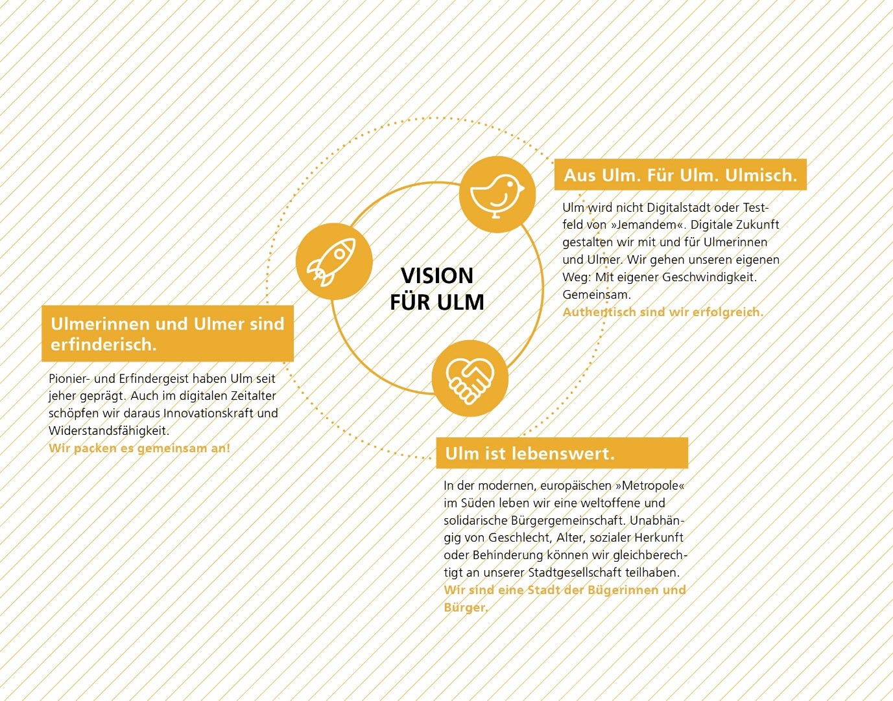
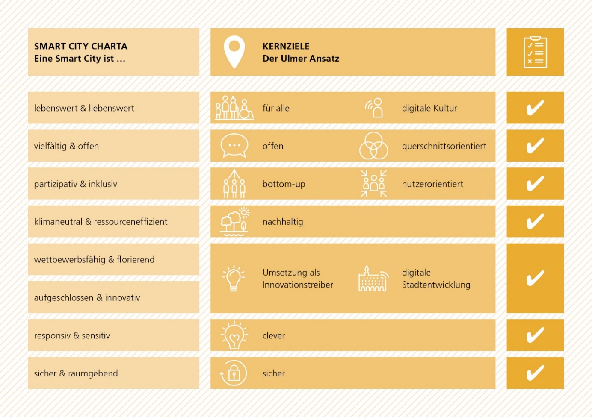

# Ulmer Verständnis einer Smart City - Ulmer Vision und Ziele  
Die digitale Transformation erfasst nahezu alle Lebens- und Arbeitsbereiche. Sie mischt die Karten in unserer Stadt neu.

**DIGITALISIERUNG ...**
* löst soziale, kulturelle, organisatorische und wirtschaftliche Veränderungen aus. 
* stellt uns vor neue Herausforderungen und bietet gleichzeitig neue Möglichkeiten der Kommunikation, Zusammenarbeit und Verzahnung zwischen Gesellschaft, Wirtschaft, Wissenschaft, Politik und Verwaltung.  
* hält Antworten bereit, die unsere Stadt nachhaltiger und die Verwaltung bürgerorientierter gestalten.  
* fördert den Zugang zu Informationen, schafft Transparenz und 
* bietet Potenzial für mehr Demokratie.

## Ulmer Vision
Die Vision ist eine gemeinsame Vorstellung dessen, was die Stadt Ulm im Kern anstrebt. Sie soll die Akteure aus Stadt, Zivilgesellschaft, Wirtschaft und Wissenschaft anregen und motivieren, gemeinsam mit uns die Digitale Stadt Ulm zu gestalten.  

> ULMER VISION EINER CLEVEREN DIGITALEN STADT: *„Die Stadt Ulm ist Vorreiterin und Leuchtturm dafür, mit Hilfe intelligenter Vernetzung digitaler Technologien den Alltag der Menschen in der Stadt zu erleichtern und die Lebensqualität zu steigern. Wir sind der Nachhaltigkeit und dem Klimaschutz verpflichtet und reduzieren den Einsatz von Ressourcen.“* 

**Digitale Stadtentwicklung** Die Digitalisierung der Lebensbereiche ist eine große Chance für die Stadtentwicklung, gleichzeitig aber auch eine Herausforderung für die Verwaltung. Für Städte bietet sie Chancen und Potentiale auf der Grundlage von Daten, neuen Services und innovativen Beteiligungsformaten Entscheidungen für eine lebenswerte Stadt der Zukunft zu treffen. Hierbei treten innovative, digitale Beteiligungsformate für die Bürgerinnen und Bürger gleichwertig neben bewährte analoge Formen der Bürger*innenbeteiligung.

**Mehr Lebensqualität durch Digitalisierung** Für die Stadt Ulm ist die Digitalisierung kein Selbstzweck, sondern immer eine Möglichkeit, durch digitale Mittel und Services die Lebensqualität in unserer Stadt auch in Zukunft zu erhalten. Dabei werden immer dann digitale Lösungen eingesetzt, wenn sie unseren Alltag einfacher machen, unsere Arbeitsabläufe erleichtern und transparente und passgenaue Lösungen für komplexe Aufgaben ermöglichen. Dabei werden analoge Prozesse nicht einfach nur digitalisiert, sondern im Licht der heutigen Möglichkeiten neu gedacht.

**Stadt der Bürgerinnen und Bürger** Die Ulmer Vision baut auf dem Charakter als traditionsbewusste, lebendige und selbstbewusste, von Bürgerinnen und Bürgern getragene Stadt auf. Bürgerinnen und Bürger gestalten den digitalen Wandel mit, um Ulm heute und in Zukunft attraktiv und lebenswert zu gestalten. Dazu zählt auch, dass digitale Kompetenzen gefördert und durch die Stadtgesellschaft selbst weitergegeben werden. Wir wollen die Möglichkeiten, die durch intelligente digitale Lösungen entstehen dafür nutzen, die Eigeninitiative und Selbsthilfekräfte der Menschen zu stärken und unsere Unterstützungsleistungen zu verbessern, damit sie weiterhin ein erfülltes und würdevolles Leben führen können.

**Erweiterung der Partizipation durch Digitalisierung** Durch die Entwicklung neuer innovativer digitaler Beteiligungsformate als gleichwertige Ergänzung bewährter analoger Formen der Bürger*innenbeteiligung erweitern sich die Möglichkeiten, gemeinsam mit der Zivilgesellschaft an guten Lösungen für die Herausforderungen der Zukunft zu arbeiten.

**Impulse für Wissenschaft und Entwicklung** Ulm ist Erfindungs- und Wissenschaftsstadt und nutzt diese kreativen und unternehmerischen Stärken, um digitale Lösungen für die Herausforderungen unserer Stadt zu finden. Damit werden neue Anwendungen ermöglicht, die das alltägliche Leben unterstützen, für einen nachhaltigeren Einsatz unserer Ressourcen sorgen, Impulse für die Wissenschaft bieten und neue Geschäftsfelder für unsere Wirtschaft aufzeigen.

**Standort für Wirtschaft und Arbeit** Die digitale Stadtentwicklung ist ein Treiber für die Standortfaktoren Wirtschaft und Arbeit. Sie fördert neue Kooperationsmöglichkeiten, neue Arbeitsplätze und den Wissenstransfer zwischen Wissenschaft, Wirtschaft und Stadtgesellschaft. Die Stadt Ulm arbeitet bei der Umsetzung der Smart City mit lokalen Unternehmen zusammen, welche aus Ulm heraus den Wandel der Stadt gestalten. Dabei ist uns bewusst, dass die Digitalisierung der Arbeitswelt zu einem enormen Wandel der Arbeitsfelder führen wird. Unsere Aufgabe wird sein, diese Transformation im Interesse der Menschen zu gestalten.

**Smart City hinterfragen** Die Stadt Ulm setzt sich proaktiv mit dem Thema Digitalisierung und Smart City auseinander. Dazu zählt, nicht auf Blaupausen oder vorgefertigte Lösungen zu setzen, sondern selbstbewusst den eigenen Weg zu gehen. Innovative Unternehmen, eine starke Forschung und eine aktive Stadtgesellschaft arbeiten gemeinsam mit der Stadtverwaltung an der digitalen und smarten Zukunft. Die Stadt Ulm ist nicht das Testfeld von irgendwem, sondern gestaltet mit allen Ulmer*innen gemeinsam den eigenen Weg.

**Kulturstadt Ulm** Wir wollen Digitalisierung dafür nutzen, Kultur zu bewahren, zu entwickeln und dafür zu begeistern. Dabei ist es uns wichtig, Analoges und Digitales als eigenständige Formen der kulturellen Aneignung und kulturelle Angebote zu entwickeln und zu ermöglichen. 

**Das Verhältnis von analog und digital im Sozialen** Die Stadt Ulm ist davon überzeugt, dass der gesellschaftliche Zusammenhalt und die Unterstützung in besonderen Lebenslagen auch weiterhin auf der Basis analoger Beziehungen und Begegnungen gestaltet werden müssen. Es sollen gemeinsam die Chancen und Möglichkeiten der Digitalisierung aktiv genutzt werden, um die breite Angebotspalette der sozialen Unterstützung der Menschen und der Bildungsangebote den sich ändernden Bedürfnissen der Bürgerschaft anzupassen. Ängste gegenüber neuen Technologien innerhalb der Bürgerschaft und der Mitarbeitenden in Verwaltung und Unternehmen werden ernst genommen und städtisches Handeln transparent und nachvollziehbar erklärt.

**Digitale Transformation und die Rolle der Menschen** Die digitale Transformation ist ein in allen gesellschaftlichen Ebenen fortlaufender, in digitalen Technologien begründeter Veränderungsprozess. Allerdings ist der digitale Wandel kein rein technologisches Phänomen, sondern ein soziotechnischer Prozess. Der Mensch steht im Zentrum – gerade weil digitale Technologien eine immer wichtigere Rolle in allen Lebensbereichen spielen. Um den Prozess der digitalen Transformation erfolgreich für und mit den Menschen gestalten zu können, braucht es ein ganzheitliches, real-digitales Verständnis von Digitalisierung, das die vielschichtigen sozialen Implikationen und Effekte mit einbezieht.

**Citizen Science** In Ulm entsteht Innovation nicht einseitig oder Top-Down, sondern wächst in einem Fünfklang aus Wissenschaft, Wirtschaft, Zivilgesellschaft, Verwaltung und Politik. Die Zivilgesellschaft gestaltet digitale Ansätze aktiv mit und kann sich so einbringen, ausprobieren und selbst mitwirken. Innovation und Neuerungen werden so durch die zivilgesellschaftlichen Akteure der Stadt selbst eingebracht. So wird auch sichergestellt, dass die Nutzerinnen und Nutzer der Lösungen und Services selbst Teil des Entwicklungsprozesses sind. Dafür wollen wir allen Menschen, vor allem Kindern und Jugendlichen den gleichberechtigten Zugang zu Bildung im Sinne von Chancengerechtigkeit ermöglichen.

**Bürgerorientierte Verwaltung als Teil der digitalen Stadt** Die Verwaltung öffnet sich für die Interessen, Anforderungen und Fähigkeiten der Bürgerinnen und Bürger, ist Partnerin und Ermöglicherin von Innovationen. Sie richtet ihre Services und Prozesse nutzer*innenorientiert aus und baut bürokratische Hürden ab. Die Verwaltungsmitarbeitenden werden dazu befähigt, die damit verbundenen steigenden Anforderungen und Ansprüche zu bewältigen.

**Sicherheit, Souveränität und Datenethik** Durch entsprechende Ratsbeschlüsse werden Rahmenbedingungen für eine sichere Infrastruktur, einen souveränen Umgang mit Daten und Leitplanken für eine digitale Ethik geschaffen. Der Umgang mit Daten folgt den Prämissen der Selbstbestimmung, Integrität und Stärkung des Schutzes persönlicher Freiheit. Datenschutz, Datensouveränität und Informationssicherheit sind die Leitlinien der verantwortungsvollen und gemeinwohlverträglichen Datennutzung.

**Resiliente Stadt** Die digitale Stadt hält Lösungen bereit, Ulm resilienter und widerstandsfähiger zu gestalten. So bleibt sie auch in und nach Krisen und Katastrophen handlungsfähig. Auftretende Schocks werden analysiert und lokalen Gegebenheiten darauf aufbauend angepasst.

**Nachhaltige und klimaneutrale Stadt** Die Stadt Ulm folgt dem Prinzip der Nachhaltigkeit. Ökologische, soziale und ökonomische Ziele werden ausgewogen und mit langfristiger Perspektive verfolgt. Digitale Lösungen bieten starke Möglichkeiten, die Ulmer Ziele im Bereich Nachhaltigkeit und Klimaneutralität zu erreichen.

## Ulmer Kernziele 

Die Stadt Ulm beschäftigt sich seit vielen Jahren mit nachhaltiger, inklusiver und digitaler Stadtentwicklung. Sie fängt nicht bei null an, sondern kann auf umfangreiche Erfahrungen aufbauen. Dabei haben sich in den letzten Jahren Werte und Prinzipien herauskristallisiert, die die Ulmer DNA darstellen. Die Kernziele sind ambitioniert – alle Lösungen müssen sich an ihnen messen. Sie sind:

**Clever …** indem wir technologieoffen erforschen und gemeinsam mit den Menschen ausprobieren, was gut für die Stadtgesellschaft in Ulm und Umgebung heute und morgen ist.

**Für alle …** indem wir bedarfsorientierte Angebote entwickeln, die Antworten auf die Herausforderungen unserer Stadt und unserer Verwaltung geben und zivilgesellschaftliche Akteure, Unternehmen sowie alle Menschen, unabhängig von Geschlecht, Alter, Behinderung, sexueller Orientierung, sozialer, kultureller und religiöser Herkunft mit einbeziehen.

**Offen …** indem wir Daten und Services offen zur Verfügung stellen und Bürgerinnen und Bürger, Unternehmen und Wissenschaft zur Entwicklung neuer Anwendungen einladen. Wir fördern Open Data und setzen, wenn möglich, auf Open Source.

**Transparent …** indem wir politische Entscheidungen für die Bürger*innen nachvollziehbar machen und neue Wege der Zusammenarbeit zwischen Verwaltung und Bürgerschaft schaffen. 

**Nachhaltig …** indem wir digitale Lösungen für mehr Umwelt­ und Lebensqualität einsetzen. Dabei orientieren wir uns an den 17 Zielen der Vereinten Nationen für eine nachhaltige Entwicklung und wollen die drei Dimensionen der Nachhaltigkeit – Ökonomie, Ökologie und Soziales – gleichermaßen in eine Ulmer Balance bringen.

**Sicher …** indem wir Vorreiter dafür werden, sicherste digitale Lösungen umzusetzen und den Nutzerinnen und Nutzern Selbstbestimmung über ihre Daten zu ermöglichen. 

**Nutzer:innenorientiert …** indem wir bei der Entwicklung digitaler Services immer Anforderungen der verschiedenen Nutzerinnen und Nutzer im Blick haben und sie aktiv einbeziehen. 

**Von unten …** indem wir unserer bürgerschaftlichen Tradition folgen und alle einladen, mitzugestalten und aktiv mit anzupacken. Ulm ist und bleibt eine Stadt der Bürgerinnen und Bürger, mit eigener Geschwindigkeit und dem Weg von unten: Der Wandel soll maßgeblich von den Akteuren gestaltet werden, die von den Veränderungen auch betroffen sind.

**Agil …** indem wir flexibel auf sich verändernde Gegebenheiten reagieren und Impulse von außen aufnehmen. Dabei haben wir die Veränderungen der Zukunft im Blick und handeln vorausschauend. 

**Näher ….** Indem wir die Relevanz lokaler und regionaler Strukturen und Akteure verdeutlichen. Quartiere und Nachbarschaften müssen gestärkt und dort entstehende Initiativen unterstützt werden. Lokale Wirtschaftskreisläufe müssen wiederaufgebaut werden, um regionale Wertschöpfungsketten zu unterstützen. Städte müssen wieder in die eigenen umliegenden Naherholungsgebiete investieren, um der Bevölkerung auch in urbanen Strukturen Rückzugsorte zu bieten.

## Ulmer Verständnis der Smart City passt zur Smart City Charta

Die Smart City Charta gibt vor, dass Kommunen einen starken Werte- und Zielebezug benötigen, um Technologien mit Bedacht und Weitblick nutzen zu können (vgl. BBSR, 2017, S. 9.). Eine Smart City ist (1) lebenswert und liebenswert, (2) vielfältig und offen, (3) partizipativ und inklusiv, (4) klimaneutral und ressourceneffizient, (5) wettbewerbsfähig und florierend, (6) aufgeschlossen und innovativ, (7) responsiv und sensitiv sowie (8) sicher und raumgebend.
Diese Leitlinien stehen im Einklang mit dem Ulmer Verständnis der Smart City und spiegeln sich in der Vision und den Kernzielen wider.

