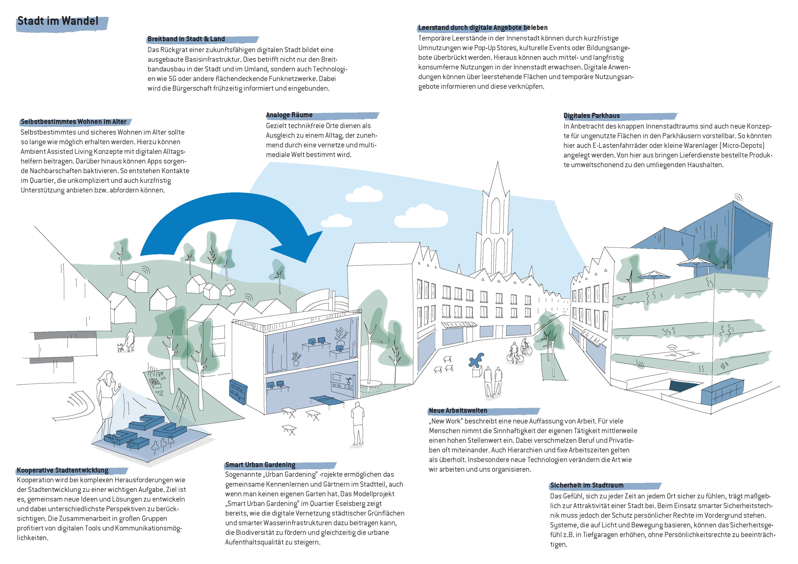
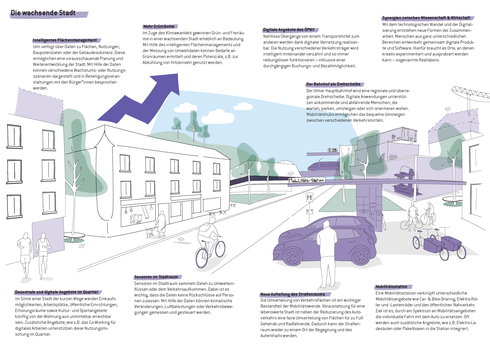
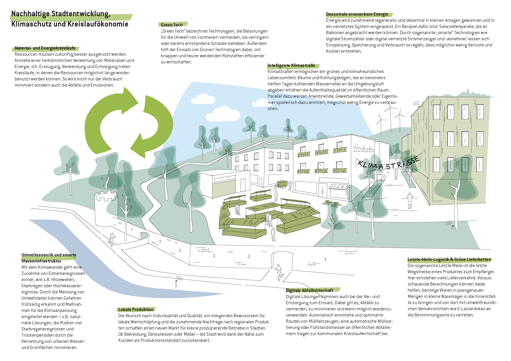
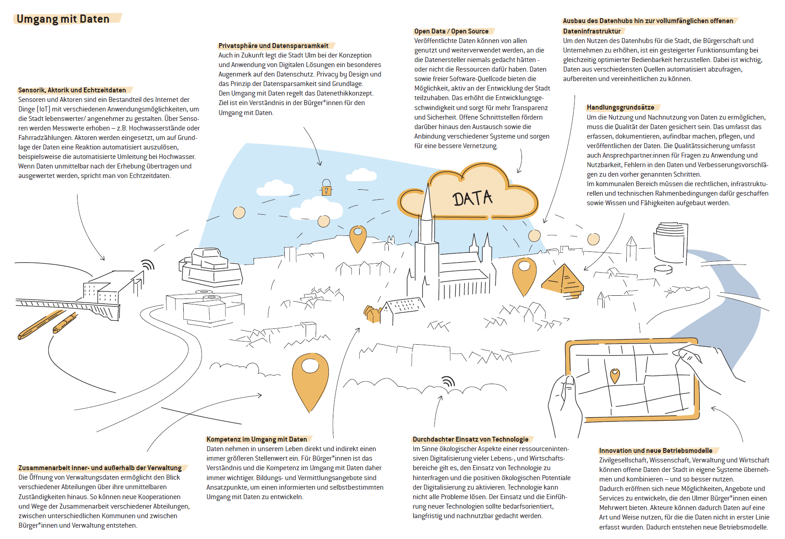

# Zielbilder für die Zukunftsaufgaben - Was wir im Fokus haben

Neben der Vision sind für die Gestaltung der Ulmer Smart City auch die nachfolgenden Zielbilder von hoher Bedeutung. Sie bilden die Brücke zwischen Ausgangslage und Zukunftsaufgaben einerseits sowie der Konkretisierung technologischer und digitaler Auswirkungen auf die Stadt in den Handlungsfeldern (vgl. Kapitel 6) andererseits. Die Inhalte der Zielbilder kommen dabei nicht von außerhalb der Stadt, sondern greifen querschnittsorientiert digitale Lösungsansätze aus den einzelnen Handlungsfeldern auf. So helfen sie dabei, digitale Möglichkeiten und Anknüpfungspunkte der Ulmer Smart City darzustellen.

## Ulm im Wandel

## Wachsende Stadt

## Nachhaltige Stadtentwicklung, Klimaschutz und Kreislaufökonomie
 

## Umgang mit Daten

