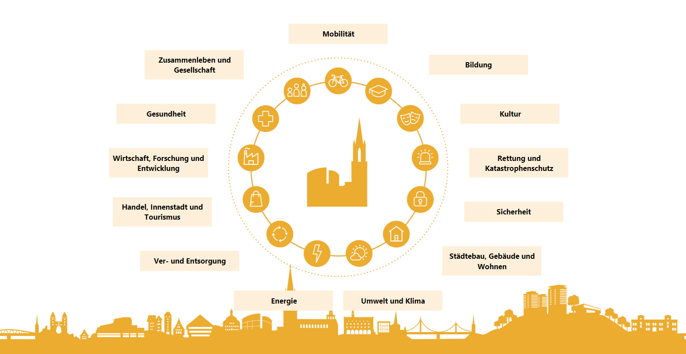

# Handlungsfelder: Wo wirkt die smarte Stadt

Die Entwicklung der Smart City Ulm findet in verschiedenen Handlungsfeldern statt. Ausgehend von der Vision und den Zielbildern der Stadt Ulm werden in den Handlungsfeldern ihre Implikationen konkretisiert. Im Rahmen des Projektes wurden 13 querschnittsorientierte Felder identifiziert. Für jedes einzelne Handlungsfeld werden in den nachfolgenden Kapiteln jeweils die Ausgangslage, Herausforderungen, Ziele sowie erste Maßnahmenansätze dargestellt.  

Entstanden sind die Handlungsfelder in einem engen Zusammenspiel aus Wissenschaft bzw. Expert:innen, Mitarbeitenden der Stadtverwaltung und der Bürgerschaft. Dazu fanden zu Beginn Interviews statt, um bestehende Grundlagen(-Dokumente) und Fachwissen aus den Abteilungen in die Erörterung der Ausgangslage durch Expert:innen zu integrieren. Viele Zielsetzungen der Handlungsfelder finden dadurch Ihren Ursprung in bereits verabschiedeten Strategien und Konzepten. Die Entwürfe der Handlungsfelder wurden mit verschiedenen Stakeholdergruppen (aus Stadtkonzern, Fachabteilungen, zivilgesellschaftlichen Institutionen etc. ) über ein Kollaborationstool direkt am Text diskutiert. Nach ihrer Überarbeitung wurden die Handlungsfelder der Bürgerschaft im Rahmen einer Online-Veranstaltung vorgestellt und Fragen sowie Anregungen besprochen. Letztendlich sind auch diese Vorschläge in die Handlungsfelder eingeflossen.  

Insgesamt legen die Handlungsfelder der Smart City Strategie den Baustein für die digitale Weiterentwicklung innerhalb der verschiedenen Themengebiete. Sie bieten darüber hinaus einen Ankerpunkt für zukünftige Strategien, sowohl gesamtstädtisch als auch in einzelnen Fachbereichen. Da die Handlungsfelder sehr umfassend aufbereitet wurden und ein breites Themenspektrum abbilden, wurde stets der Bezug innerhalb des Handlungsfeldes zur Digitalisierung hergestellt.
Des Weiteren verfolgt die Ulmer Strategie den ambitionierten Anspruch, Nachhaltigkeit und Digitalisierung miteinander zu verknüpfen, also mittels digitaler Technologien einen Beitrag zur nachhaltigen Entwicklung zu leisten. Aus diesem Grund ist das Thema Nachhaltigkeit ein inhärenter Aspekt jedes Handlungsfeldes. Den Ausgangspunkt bieten die Nachhaltigkeitsziele der Vereinten Nationen (SDGs [^12]), die bei der Erarbeitung berücksichtigt wurden und Einzug in die Handlungsfelder gefunden haben.   

Der Entstehungsprozess der Smart City Strategie wurde maßgeblich durch die Auswirkungen der Corona-Pandemie beeinflusst. Die disruptiven Veränderungen werden nicht mit sinkenden Infektionszahlen verschwinden, sondern langfristig die Art wie wir leben, denken, bauen und handeln beeinflussen. Dementsprechend wurde auch in den einzelnen Handlungsfeldern Bezug auf die Auswirkungen und Folgen der Pandemie genommen.  

Die Grenzen zwischen den Handlungsfeldern sind fließend und Projekte aus den verschiedenen Bereichen profitieren durch Wechselbeziehungen und Synergieeffekte. Besonders hervorzuheben sind die zu schaffenden Grundlagen, die für die Umsetzung der Strategie eine notwendige Voraussetzung sind. Technische Grundlagen und Kompetenzen sowie organisatorische und kulturelle Grundlagen werden in den Kapiteln 7 und 8 ausführlich dargestellt.



[^12]: https://17ziele.de/; https://sdg-portal.de/de


```{toctree}
---
maxdepth: 2
---
06.01_Mobilitaet/index.md
06.02_Bildung/index.md
06.03_Kultur/index.md
06.04_Rettung_und_Katastrophenschutz/index.md
06.05_Sicherheit/index.md
06.06_Staedte_Gebaeude_Wohnen/index.md
06.07_Umwelt_und_Klima/index.md
06.08_Energie/index.md
06.09_Ver_und_Entsorgung/index.md
06.10_Handel_Innenstadt_und_Tourismus/index.md
06.11_Wirtschaft_Forschung_und_Entwicklung/index.md
06.12_Gesundheit/index.md
06.13_Zusammenleben_und_Gesellschaft/index.md

```
